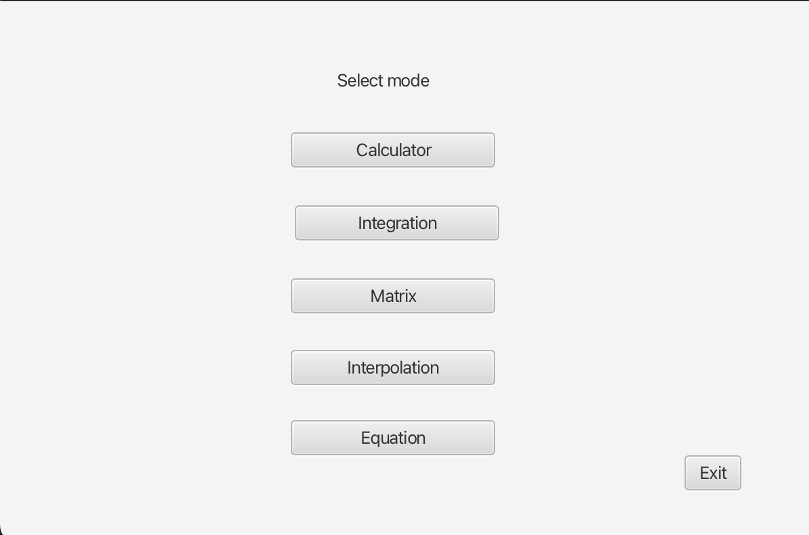
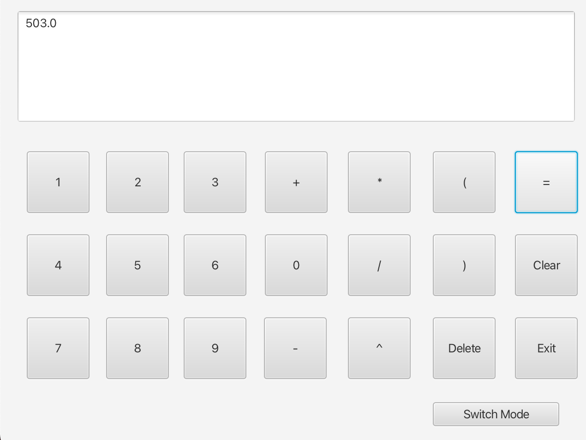
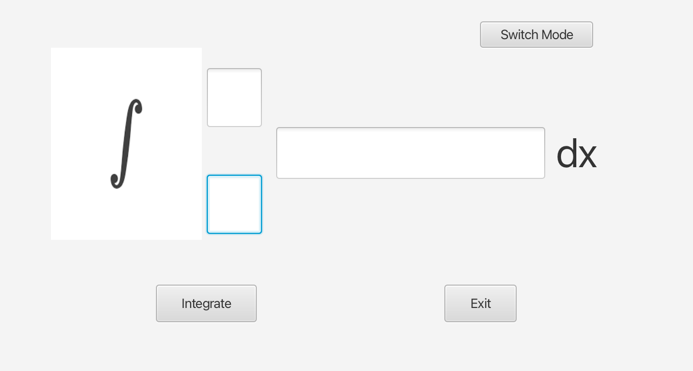
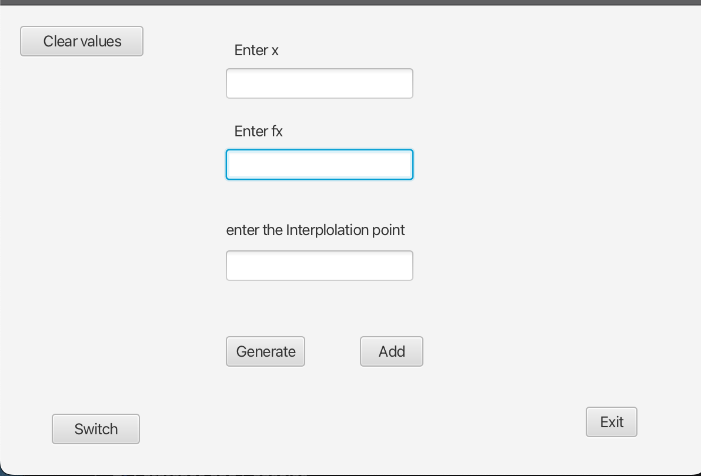
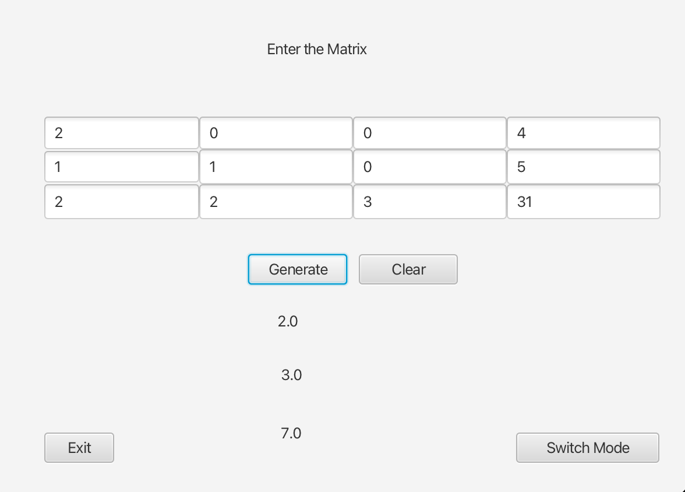
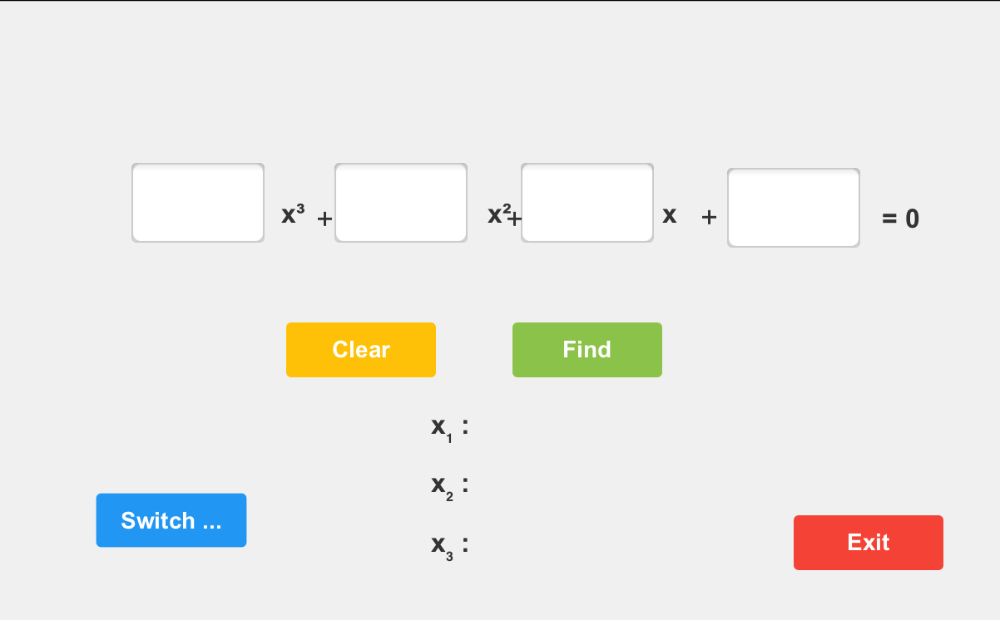

# AlgoMathFx

## Overview  
AlgoMathFx is a JavaFX-based application that helps users visualize and interact with various mathematical algorithms. The project demonstrates essential mathematical computations using Java and JavaFX, making complex calculations more intuitive and engaging.

The project includes:  
- **Fundamental arithmetic evaluations** using BODMAS rules.  
- **Numerical integration techniques** for solving definite integrals.  
- **Matrix equation solvers** to handle systems of linear equations.  
- **Quadratic & cubic equation solvers** for finding real and complex roots.  
- **Mathematical interpolation methods** to estimate unknown values between data points.  

## Features  
- **BODMAS Calculator** - Evaluate arithmetic expressions with operator precedence.  
- **Numerical Integrator** - Approximate integrals using numerical techniques.  
- **Matrix Equation Solver** - Solve systems of linear equations.  
- **Quadratic & Cubic Equation Solver** - Find equation roots efficiently.  
- **Mathematical Interpolation** - Implement interpolation methods for data estimation.  
- **Interactive JavaFX UI** - A user-friendly graphical interface for computations.  

## Technologies Used  
- **Java** - Core programming language.  
- **JavaFX** - GUI framework for creating interactive applications.  
- **Numerical Methods** - Used for solving equations and performing interpolation.  
- **Maven**  - Dependency management.  

## Screenshots
  Here are some preview of the application :

### Initial UI

### Bodmas Caclulator

### Integration Caculator

### Interpolation Caculator

### 3x4 Matrix Equation Solver

### Quadratic and Cubic Equation Solver

## Conclusion

This project demonstrates various mathematical algorithms implemented from scratch using Java and JavaFX. 
It serves as an interactive tool for solving equations, performing numerical integration, and exploring mathematical interpolation techniques. 

If you find this project useful or have any suggestions for improvements, feel free to contribute!

  
